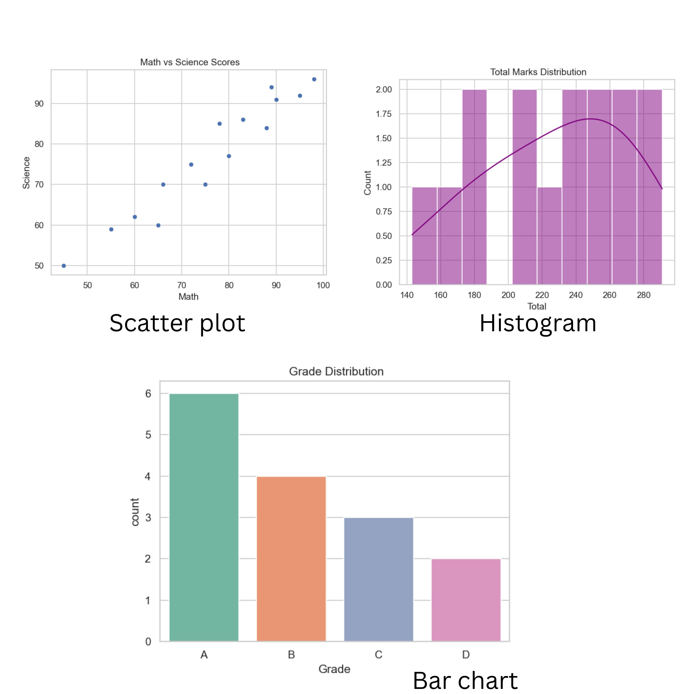
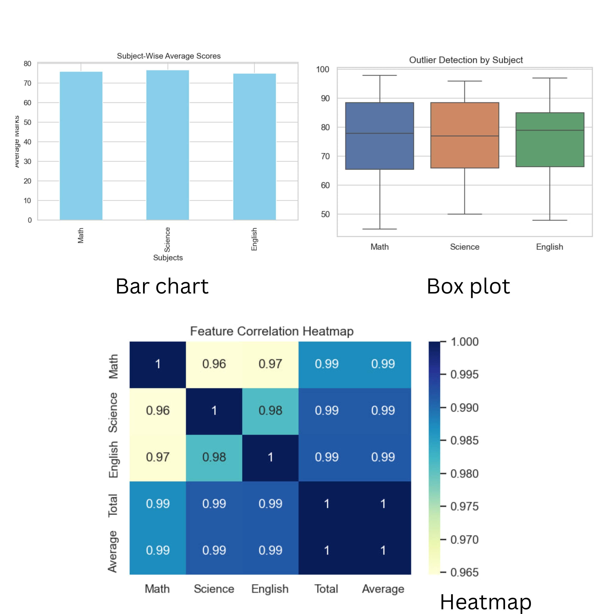

# 📘 Student Performance Analyzer

A Python-based project to analyze student marks data using popular data libraries — ideal for those learning **data handling**, **visualization**, and **exploratory data analysis (EDA)**.

---

## 📌 Project Overview

This project loads a student marks dataset (CSV), processes the data, analyzes performance, and visualizes trends using:
- 📊 **Matplotlib**
- 🌈 **Seaborn**
- 🧮 **Pandas**
- 🔢 **NumPy**

It demonstrates how to clean data, detect top scorers, explore subject-wise distributions, and spot outliers — essential skills for aspiring AI/ML developers.

---

## 🧠 Features

- Load and clean student data
- Calculate total scores and grades
- Visualize:
  - Grade distribution
  - Subject-wise averages
  - Heatmaps for correlations
  - Boxplots to spot outliers
  - Pairwise relationships

---

## 📂 Folder Structure

```
project1/
├── analyzer.py            # Main Python file
├── marks.csv              # Sample student data
├── output_graphs/         # Saved plots (optional)
```

---

## ⚙️ How to Run

> ⚠️ Make sure to activate your virtual environment and install dependencies first.

```bash
pip install pandas matplotlib seaborn
```

Then run:

```bash
python analyzer.py
```

---

## 📊 Sample Visuals





---

## 📁 Dataset

The project uses a CSV file (`marks.csv`) containing:
- Student names
- Subject-wise marks (Math, Science, English)
- Calculated Total and Grade

---

## 🚀 Learning Outcomes

This project helped me:
- Strengthen Python basics
- Understand EDA in real data
- Practice data visualization for AI/ML workflows

---

## 🏷️ Tech Stack

- Python 3.x  
- NumPy  
- Pandas  
- Matplotlib  
- Seaborn  

---

## 💬 Connect

📫 Feel free to connect with me on [LinkedIn](https://www.linkedin.com/in/tanuja-annam/) and share your thoughts or suggestions!
